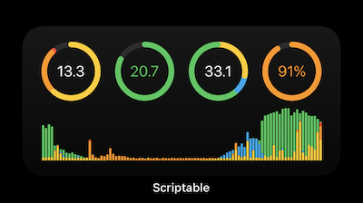

# iOS Energy Widget

Scriptable.app-based iOS widget which visualizes the energy production and energy consumption from the last 24 hours.

Data is read from a Grafana server with an InfluxDB time-series database.

Visualized data:

- Top - from left to right:
  - Consumption mix (in kWh): photovoltaics consumption (yellow), battery consumption (orange), grid consumption (red); with a full circle of 15
  - Grid feed (in kWh): energy fed into the grid (green); with a full circle of 25
  - Production mix (in kWh): photovoltaics consumption (yellow), battery charge (blue), grid feed (green)
  - Battery state: current battery charge level as percentage
 
 - Bottom:
   - Stacked values in 30-minutes intervals
