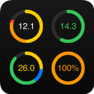
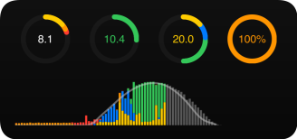

# iOS Energy Widget

A [Scriptable.app](https://scriptable.app)-based iOS widget which visualizes the energy production and energy consumption of your house from the last 24 hours.

Data is read from a Grafana server with an InfluxDB time-series database as data store.

## Example

Styles - selected via widget parameter:

- Small:

  - Single style; style parameter is ignored

    

- Medium:

  - `style=1;time-range=last-24h`

    

  - `style=1;time-range=today`

    

  - `style=2;time-range=last-24h`

    

  - `style=3;time-range=last-24h`

    

  - `style=3;time-range=today`

    

Visualized data:

- Circles - from left to right / from top-left to bottom-right:
  - Consumption mix (in kWh): photovoltaics consumption (yellow), battery consumption (orange), grid consumption (red); with a full circle of 15 or sum
  - Grid feed (in kWh): energy fed into the grid (green); with a full circle of 25 or sum
  - Production mix (in kWh): photovoltaics consumption (yellow), battery charge (blue), grid feed (green); with a full circle of 30 or sum
  - Battery state: current battery charge level as percentage
 
 - Timeline:
   - Stacked values in 15-minutes intervals

Widget parameters:

* `style`: visual style of the widget; valid values: `1`, `2`, `3`
* `time-range`: time range to display; valid values: `last-24h`, `today`

Widget parameters are passed as `key1=value1;key2=value2;...`.

