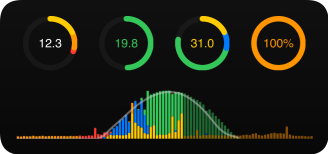
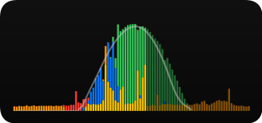
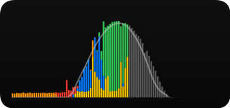

# iOS Energy Widget

A [Scriptable.app](https://scriptable.app)-based iOS widget which visualizes the energy production and energy consumption of your house from the last 24 hours, including forecast data.

Data is read from a Grafana server with an InfluxDB time-series database as data store, or from a regulary updated, server-hosted file.

## Examples

Styles - selected via widget parameter:

- Small widget:

  - `style=1`

    

  - `style=4`

    

- Medium widget:

  - `style=1;time-range=last-24h`

    

  - `style=1;time-range=today`

    

  - `style=2;time-range=last-24h`

    

  - `style=3;time-range=last-24h`

    

  - `style=3;time-range=today`

    

Visualized data:

- Circles - from left to right / from top-left to bottom-right:
  - Consumption mix (in kWh): photovoltaics consumption (yellow), battery consumption (orange), grid consumption (red); with a full circle of 15 or sum
  - Grid feed (in kWh): energy fed into the grid (green); with a full circle of 25 or sum
  - Production mix (in kWh): photovoltaics consumption (yellow), battery charge (blue), grid feed (green); with a full circle of 30 or sum
  - Battery state: current battery charge level as percentage
 
 - Timeline:
   - Stacked values in 15-minutes intervals
   - A gray line visualizes the forecast data

Widget parameters:

* `style`: visual style of the widget; valid values: `1`, `2`, `3`, `4`
* `time-range`: time range to display; valid values: `last-24h`, `today`
* `server`: server section to use; valid values are defined by the `data: servers:` configuration section, e.g. `grafana` or `file`

Widget parameters are passed as `key1=value1;key2=value2;...`.

## Configuration

To configure the widget, edit the `C` constant in the configuration section of the widget.

Time series, based on 15min intervals:

* `photovoltaics: consume:`: Photovoltaics energy, directly consumed by your house
* `photovoltaics: forecast:`: Forecast of the photovoltaics energy production (optional)
* `battery: charge:`: Energy used to charge your battery (optional)
* `battery: consume:`: Energy consumed from your battery (optional)
* `battery: level:`: Current charge level of your battery (optional)
* `grid: feed:`: Energy fed into the power grid
* `grid: consume:`: Energy consumed from the power grid

For optional time series, just remove the `query` field.

Servers:

* `servers: grafana:`: Connection details for the Grafana server
* `servers: file:`: Connection details for a server-hosted file with the current measurements / Grafana query results

